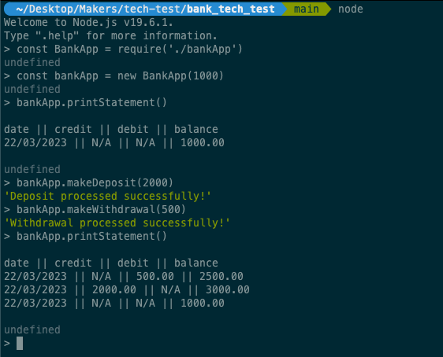

# Bank Application

## Description

This is a simple command-line bank application built with JavaScript that allows users to make deposits, withdrawals, and print bank statements.
It keeps track of the transactions made by the user and displays them in a table with the date, credit, debit, and balance.

## Installation

To install the required dependencies, run the following command in the project directory:

```
npm install
```

## Test

To run the tests, use the following command:

```
npm test
```

## Usage

To run the application, use the following command:

```
node
const BankApp = require('./bankApp')
const bankApp = new BankApp()
```

## Approach

The application was built with a test-driven development (TDD) approach, where tests were written first before writing the code.
The application was also built using Object-Oriented Programming (OOP) principles, where a class was created to encapsulate the functionality of the application.

## Code Structure

The main class of this application is `BankApp`. This class interacts with the user and states of the application. 
This class contains the functionality of the application, such as getting the balance, making deposits and withdrawals, and printing bank statements.
The class also requires other helper classes for formatting the date, input and storing transactions.

- `InputFormatter`: This class handles the formatting of user input to ensure that it meets the application's requirements. It is used by BankApp to convert user inputs such as balance amounts and transaction amounts.
- `DateFormatter`: This class handles the formatting of dates to ensure that they are in the correct format for the application. It is used by BankApp to parse and format dates in transaction records.
- `Transaction`: This class stores transaction records. It contains information such as the date, transaction type, and transaction amount.

These helper classes are designed to work together with BankApp to provide a seamless user experience while ensuring data consistency throughout the application.

## Examples

```
# Load in the file
const BankApp = require('./bankApp')

# Initialize
node
const bankApp = new BankApp() # Starting balance will be 0 without input
const bankAppNum = new BankApp(1000) # Starting balance will be 1000
const bankAppStr = new BankApp('1000') # Starting balance will be 1000
const bankAppErr = new BankApp('money') # An Error will be thrown: Balance should be an Integer

# Make a deposit
bankApp.makeDeposit(1000) # It adds a 1000 credit transactions
bankApp.makeDeposit('1000') # It adds a 1000 credit transactions
bankApp.makeDeposit(10.333) # It will convert to only two decimal => 10.33
bankApp.makeDeposit('money') # Message: The amount should be an Integer

# Make a withdrawal
# When the balance is less than withdrawal amount,
# it will return a message 'The amount of balance is not enough for withdrawal'

bankApp.makeWithdrawal(1000) # It adds a 1000 debit transactions
bankApp.makeWithdrawal('1000') # It adds a 1000 debit transactions
bankApp.makeWithdrawal(10.333) # It will convert to only two decimal => 10.33
bankApp.makeWithdrawal('money') # Message: The amount should be an Integer

# Print a statement
bankApp.printStatement()

```

## Screenshot

